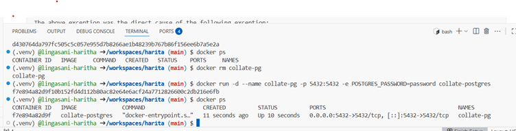
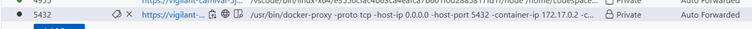
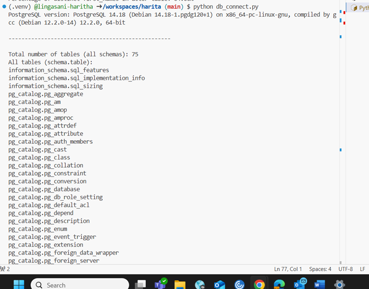
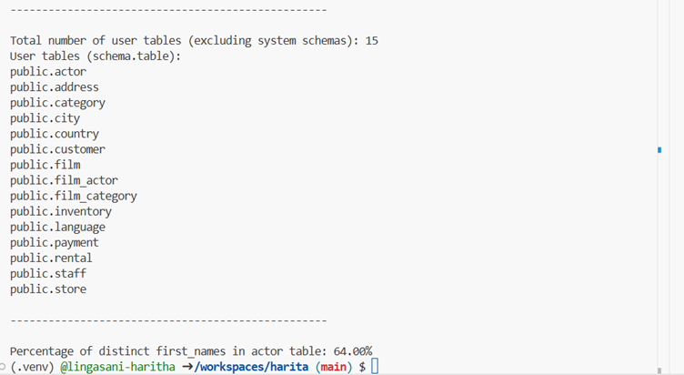
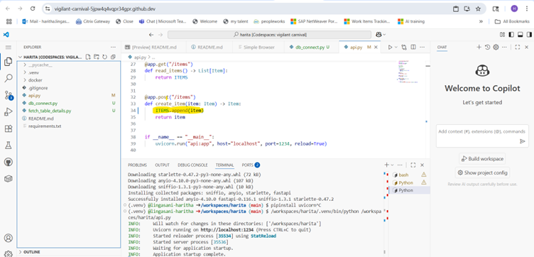
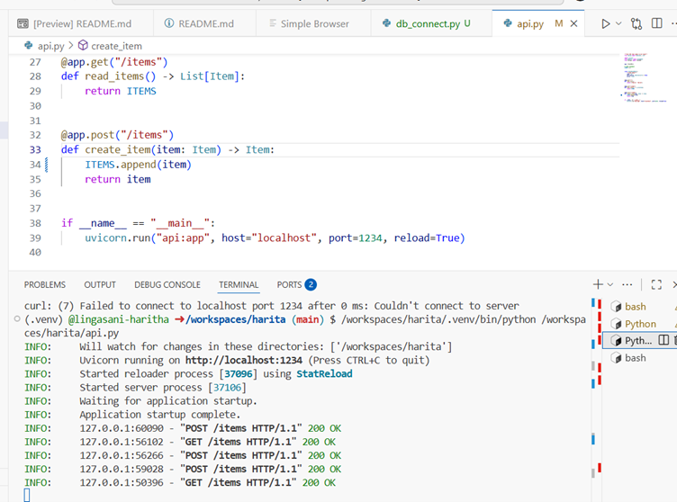
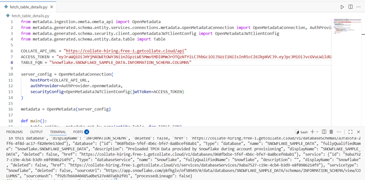

# Take-Home Assessment — Solutions & Explanations

This repository contains my solutions for the Take-Home Assessment involving Docker, PostgreSQL, Python, SQL, FastAPI, and API integration with Collate (OpenMetadata).

---

## Step 1: Start the Database with Docker

**What I Did:**
- Built the PostgreSQL Docker image:
  ```bash
  docker build -t collate-postgres -f docker/Dockerfile_postgres .
  ```
- Ran the container with environment variables and port mapping:
  ```bash
  docker run -d --name collate-pg -p 5432:5432 -e POSTGRES_PASSWORD=password collate-postgres
  ```
- Verified the container was running:
  ```bash
  docker ps
  ```


**Terminal Output:**
```
(.venv) @lingasani-haritha ➜ /workspaces/harita (main) $ docker --version
Docker version 28.3.1-1, build 38b7060a218775811da953650d8df7d492653f8f
(.venv) @lingasani-haritha ➜ /workspaces/harita (main) $ docker build -t collate-postgres -f docker/Dockerfile_postgres . 
[+] Building 1.9s (12/12) FINISHED docker:default 
=> [internal] load build definition from Dockerfile_postgres 0.0s 
=> => transferring dockerfile: 256B 0.0s 
=> [internal] load metadata for docker.io/library/postgres:14 1.8s 
=> [auth] library/postgres:pull token for registry-1.docker.io 0.0s 
=> [internal] load .dockerignore 0.0s 
=> => transferring context: 2B 0.0s 
=> [1/6] FROM docker.io/library/postgres:14@sha256:563a4985838fcb5ac2e60fd58a1055ceafa791665e75e18d236221af0d478a33 0.0s 
=> [internal] load build context 0.0s 
=> => transferring context: 218B 0.0s 
=> CACHED [2/6] WORKDIR /docker-entrypoint-initdb.d 0.0s 
=> CACHED [3/6] COPY docker/* . 0.0s 
=> CACHED [4/6] RUN apt-get update && apt-get install -y unzip 0.0s 
=> CACHED [5/6] RUN unzip sample.zip && tar -xvf dvdrental.tar 0.0s 
=> CACHED [6/6] RUN chmod -R 775 /docker-entrypoint-initdb.d 0.0s 
=> exporting to image 0.0s 
=> => exporting layers 0.0s 
=> => writing image sha256:9c5f95dba5f5d8efb96726418c0250d6a03faf7f2cc8d9ae196619e246c916fd 0.0s 
=> => naming to docker.io/library/collate-postgres 
(.venv) @lingasani-haritha ➜ /workspaces/harita (main) $ docker run -d --name collate-pg -p 5432:5432 -e POSTGRES_PASSWORD=password collate-postgres 
f7e894a82d9f10b152fd4d112b80ac82e64e6acf24a7712826600c2db216e6fb 
(.venv) @lingasani-haritha ➜ /workspaces/harita (main) $ docker ps 
CONTAINER ID IMAGE COMMAND CREATED STATUS PORTS NAMES 
f7e894a82d9f collate-postgres "docker-entrypoint.s…" 11 seconds ago Up 10 seconds 0.0.0.0:5432->5432/tcp, [::]:5432->5432/tcp collate-pg 
(.venv) @lingasani-haritha ➜ /workspaces/harita (main) $ 
Docker running
```
**Challenges Faced:**
- Container exited immediately after start due to missing/incorrect `POSTGRES_PASSWORD`.
- Resolved by adding the correct environment variable and checking logs
 

**Alternatives Considered:**
- Running PostgreSQL directly on the host (chose Docker for isolation).

**Screenshot:**  




---

## Step 2: Connect to the Database with Python

**What I Did:**
- Installed `psycopg2-binary`:
  ```bash
  pip3 install psycopg2-binary
  ```
- Wrote a Python script to connect and query the database:
  ```bash
  python db_connect.py
  ```

**Queries Used:**
```sql
-- Test connection
SELECT version();

-- Count tables
SELECT COUNT(*) FROM information_schema.tables WHERE table_type = 'BASE TABLE';

-- List user table names
SELECT table_schema, table_name
FROM information_schema.tables
WHERE table_type = 'BASE TABLE'
  AND table_catalog = 'dvdrental'
  AND table_schema NOT IN ('pg_catalog', 'information_schema')
ORDER BY table_schema, table_name;

-- % distinct first_names in actor
SELECT ROUND(100.0 * COUNT(DISTINCT first_name) / COUNT(*), 2) AS distinct_first_name_percentage
FROM actor;
```

**Output:**
```
PostgreSQL version: PostgreSQL 14.18 ...
Total number of tables (all schemas): 75
Total number of user tables (excluding system schemas): 15
User tables: public.actor, public.address, ...
Percentage of distinct first_names in actor table: 64.00%
```

**Challenges Faced:**
- Filtering out system tables and user tables.
- Writing efficient SQL for distinct percentage.

**Screenshot:**  





---

## Step 3: Debugging Operational Errors

### 3.1 Password Authentication Failed

**Error:**
```
OperationalError: connection to server at "localhost", port 5432 failed: FATAL:  password authentication failed for user "test"
```

**What It Means:**  
The database refused your login attempt because of incorrect credentials or password.

**How I Would Handle It:**
- **Verify Credentials:** Double-check the username and password the user and I am using. Make sure they match what is configured in the PostgreSQL server (see `docker/z-postgres-script.sql`).
- **Test Manual Connection:** Try connecting manually using:
  ```bash
  psql -U test -h localhost -p 5432
  ```
- **Check Connection String:** Ensure Python or application connection string includes the correct credentials and is properly formatted.
- **Review Authentication Settings:** Check the `pg_hba.conf` file to confirm password authentication is enabled (e.g., `md5` or `scram-sha-256`).
- **Add Error Handling:** In your Python code, catch `OperationalError` and provide a clear message to the user.

**If user continue to face issues:**  
Request user to please verify your credentials and reset your password if necessary. Also, check database configuration to allow password logins and to provide the exact connection string (without passwords) and any relevant PostgreSQL server logs so I can assist further.

---

### 3.2 Connection Refused

**Error:**
```
OperationalError: connection to server at "localhost", port 5432 failed: Connection refused
```

**What It Means:**  
The PostgreSQL server is not running or not listening on the expected port.

**How I Would Handle It:**
- **Check if Server is Running:** Confirm the Docker container is running:
  ```bash
  docker ps
  ```
- **Verify Port Mapping:** Ensure port 5432 is mapped correctly:
  ```bash
  netstat -plnt | grep 5432
  ```
- **Check Logs:** Look at the PostgreSQL logs inside the container:
  ```bash
  docker logs <container>
  ```
- **Firewall/Network:** Make sure there are no firewall or OS-level blocks preventing access.

**If you continue to face issues:**  

If user keeps encountering a “connection refused” error, ensure  database server is running and accepting TCP/IP connections on the expected port, and that no firewalls or Docker misconfigurations are blocking access and to provide details about your Docker setup, port mappings, and any error logs.

---

## Step 4: Fixing the API

### 4.1 Debugging the call

**Error from customer:**
```
{"detail":[{"type":"missing","loc":["body"],"msg":"Field required","input":null}]}
```

**What Went Wrong:**  
Curl command did not include `-d` flag, so JSON was not sent in the request body.

**How I Fixed It:**
- Updated curl command:
  ```bash
  curl -X POST -H "Content-Type: application/json" -d '{"name": "Pizza", "price": 1.15}' http://localhost:1234/items
  ```
- Explain to customer that the API expects JSON data in the body.

---

### 4.2 Internal Server Error Fix

**Cause:**
```python
ITEMS = ITEMS.append(item)
```
`.append()` returns None, so ITEMS became None, causing crashes.

**Fix:**
```python
ITEMS.append(item)
```
POST requests now successfully store data.
---

**Validations & Terminal Outputs:**

- **POST request validation:**
  ```
  (.venv) @lingasani-haritha ➜ /workspaces/harita (main) $ curl -X POST -H "Content-Type: application/json" -d '{"name": "Pizza", "price": 1.15}' http://localhost:1234/items
  {"name":"Pizza","description":null,"price":1.15}
  ```

- **Additional POST and GET requests:**
  ```bash
  curl -X POST -H "Content-Type: application/json" -d '{"name": "chocolate", "price": 2}' http://localhost:1234/items
  curl http://localhost:1234/items
  ```
  Output:
  ```
  [{"name":"Pizza","description":null,"price":1.15},{"name":"chocolate","description":null,"price":2.0},{"name":"chocolate","description":null,"price":2.0}]
  ```

---

**Screenshot:**  



**Summary:**

- **4.1 (Debugging the call):**  
  The "Field required" error occurred because the API expected a JSON body, but the curl request was missing the `-d` flag. This was resolved by sending the JSON data correctly, ensuring the API's POST `/items` endpoint receives an `Item` model in the body.

- **4.2 (Debugging the API):**  
  The Internal Server Error was caused by assigning the result of `ITEMS.append(item)` (which is `None`) back to `ITEMS`, breaking the list. The fix was to simply call `ITEMS.append(item)` without assignment, so the list updates correctly.

---

## Step 5: Python SDK & API Interaction with Collate (OpenMetadata)

**What I Did:**
- Logged into Collate instance at [Collate](https://collate-hiring.free-1.getcollate.cloud/) with provided credentials.
- Generated Personal Access Token (PAT).
- Installed OpenMetadata Python SDK:
  ```bash
  pip install "openmetadata-ingestion~=1.9.0.0"
  ```
- Wrote Python script to:
  - Authenticate using PAT.
  - Use `list_entities` to fetch tables.
  - Filter tables by FQN: `Snowflake.SNOWFLAKE_SAMPLE_DATA.INFORMATION_SCHEMA.COLUMNS`
  - Retrieve table details by ID.


**Output:**
```
Table Found: root='COLUMNS'
Table ID: root=UUID('b58e3c0d-dc4f-401a-8b51-9dcfbfc567b0')
Detailed Table Info: {...}
```

**Challenges Faced:**
- Understanding SDK usage and authentication flow.
- Mapping FQN to table ID.
- Handling API request headers.

**Screenshot:**  


---

## Summary

This assessment helped me solidify foundational skills in:
- Building Docker Image. 
- Writing SQL queries and connecting via Python.
- Debugging common database connection issues.
- Understanding HTTP request format and FastAPI request handling.
- Working with third-party API SDKs and authentication.

**How to Run:**
- Build and run the PostgreSQL Docker container:
  ```bash
  docker build -t collate-postgres -f docker/Dockerfile_postgres .
  docker run -d --name collate-pg -p 5432:5432 -e POSTGRES_PASSWORD=password collate-postgres
  ```
- Run Python DB connection script:
  ```bash
  python db_connect.py
  ```
- Start FastAPI server and test API:
  ```bash
  python api.py
  ```
- Run Python script for Collate API:
  ```bash
  python fetch_table_details.py
  ```


Thank you for reviewing my submission.  
— Haritha Lingasani
